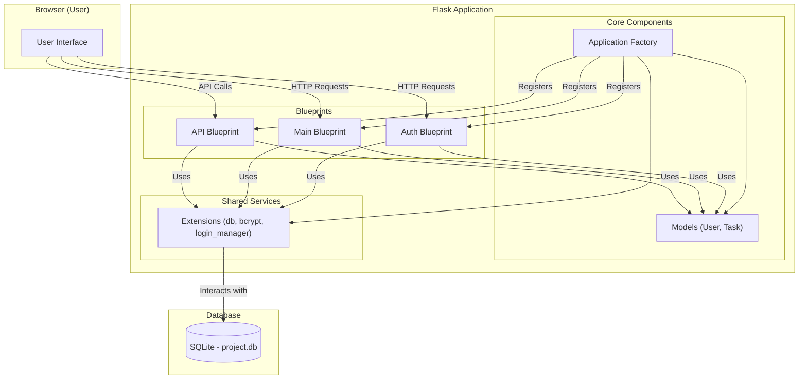

# Flask Mission Control

### **By George Freedom**

A full-stack database-driven To-Do application built with Flask. It serves as a practical case study for architecting a modern web application using professional patterns and an AI-assisted workflow.

--

## 🚀 Key Features
* **Secure Access Control:** Robust session-based authentication using Flask-Login with Bcrypt password hashing.

* **Dynamic Task Management:** Full CRUD operations for personalized task tracking with automated UTC timestamps.

* **Machine-to-Machine API:** Programmatic data access via a dedicated RESTful JSON endpoint (/api/tasks).

* **Minimalist Responsive UI:** High-performance, clean interface built with Pico CSS and Jinja2 templates.

* **Scalable Modularity:** Built with the Application Factory pattern, ensuring the codebase is ready for future expansion.

--

## ⚙️ System Architecture
The application utilizes the **Application Factory** pattern (`create_app` in `app/__init__.py`) for flexible configuration and initialization. It is structured into three distinct **Blueprints**. Data persistence is handled by an **SQLite database** located in the `instance` folder, managed via **Flask-SQLAlchemy**. User passwords are securely hashed using **Flask-Bcrypt**.

### 🔐 Auth Blueprint (Access Management)
* **Identity Logic:** Handles user registration, login cycles, and session persistence.

* **Validation Layer:** Implements secure form handling and server-side validation via WTForms.

### 📋 Main Blueprint (Core Logic)
* **Operational Dashboard:** Orchestrates the primary user interface and task-management workflows.

* **Data Persistence:** Interfaces with SQLAlchemy ORM for efficient SQLite database operations.

### 🔌 API Blueprint (The Interface)
* **RESTful Endpoint:** Exposes /api/tasks for authenticated JSON communication (GET/POST).

* **Interoperability:** Provides ISO 8601 compliant data for external system integration.

--

### System Diagram



## File Structure
```
flask-mission-control/
│
├── app/                      # Main application package
│   ├── __init__.py           # Application Factory
│   ├── models.py             # SQLAlchemy models (User, Task)
│   ├── extensions.py         # Extension instances (db, bcrypt, login_manager)
│   ├── config.py             # Configuration classes
│   ├── commands.py           # Custom CLI commands (e.g., init-db)
│   │
│   ├── main/                 # Main Blueprint (Dashboard, Index, About)
│   │   ├── __init__.py
│   │   ├── routes.py
│   │   └── forms.py            # Task Form
│   │
│   ├── auth/                 # Auth Blueprint (Login, Register, Logout)
│   │   ├── __init__.py
│   │   ├── routes.py
│   │   └── forms.py            # Login & Registration Forms
│   │
│   ├── api/                  # API Blueprint
│   │   ├── __init__.py
│   │   └── routes.py
│   │
│   ├── static/               # Static files (CSS, JS)
│   │   └── css/
│   │       └── site.css      # Custom styles (overrides Pico)
│   │
│   └── templates/            # Jinja2 templates
│       ├── base.html         # Base layout template
│       ├── header.html       # Navigation header include
│       ├── footer.html       # Footer include
│       │
│       ├── main/             # Templates for 'main' blueprint
│       │   ├── dashboard.html
│       │   ├── index.html
│       │   ├── about.html
│       │   └── update_task.html
│       │   └── add_task.html
│       │
│       └── auth/             # Templates for 'auth' blueprint
│           ├── login.html
│           └── register.html
│
├── instance/                 # Instance-specific files (DB, secrets - NOT in Git)
│   └── project.db            # SQLite database file
│
├── venv/                     # Virtual environment folder (NOT in Git)
│
├── wsgi.py                   # WSGI entry point for production servers
├── requirements.txt          # Python package dependencies
├── .env                      # Environment variables for development (NOT in Git)
├── .gitignore                # Files/folders ignored by Git
└── README.md                 # This file
```

## 💡 Development Philosophy & AI Collaboration
This project was intentionally developed using a modern, AI-augmented workflow to explore and demonstrate efficient development practices.

The process involved:

**Human-led architectural design:** Defining the project goals, requirements, structure (using patterns like Application Factory and Blueprints), and key principles (SOLID, SoC).

**AI-assisted scaffolding (LLM - e.g., Google Gemini):** Generating the initial project structure, boilerplate code, and documentation outlines based on the architectural plan.

**AI-assisted implementation (GitHub Copilot):** Writing tactical code within the IDE, handling routine tasks, generating functions/classes based on comments, and suggesting completions.

**Human-driven quality assurance:** Performing critical code reviews, debugging, testing, making final design decisions, and ensuring the final product meets the requirements.

This approach simulates a future-oriented development cycle where the developer's primary value shifts from writing every line of code to designing robust systems, effectively orchestrating AI tools, and guaranteeing the quality and integrity of the final result. It emphasizes the role of the developer as an architect and strategist.


## ⚙️ How to Run

1.  **Clone the Repository:**
    ```bash
    git clone https://github.com/GeorgeFreedomTech/flask-mission-control.git
    cd flask-mission-control
    ```
2.  **Create and Activate a Virtual Environment:**
    ```bash
    python -m venv venv
    # On Windows: venv\Scripts\activate
    # On macOS/Linux: source venv/bin/activate
    ```
3.  **Install Dependencies:**
    ```bash
    pip install -r requirements.txt
    ```
4.  **Create .env File:** Create a .env file in the project root directory and add the required environment variables 
    (copy from the example below, generating your own SECRET_KEY):
    ```bash
    # .env
    # Generate a strong secret key, e.g., using Python:
    >>> import os; os.urandom(24).hex()
    SECRET_KEY='your_generated_secret_key_here'
    DATABASE_FILE='project.db'
    FLASK_APP='wsgi.py' # Tells Flask where the app is
    FLASK_DEBUG='1'     # Enables debug mode for development
    ```
5.  **Initialize the Database:** Run the custom Flask command to create the database tables based on your models.
    ```bash
    flask init-db
    ```
6.  **Run the Development Server:**
    ```bash
    flask run
    ```

## 🔗 Let's Connect:

* Visit my website: **[https://GeorgeFreedom.com](https://GeorgeFreedom.com)**
* Connect on LinkedIn: **[https://www.linkedin.com/in/georgefreedom/](https://www.linkedin.com/in/georgefreedom/)**
* Let's talk: **[https://cal.com/georgefreedom](https://cal.com/georgefreedom)**


## 📜 License:

Copyright (c) 2025 Jiří Svoboda (George Freedom) / George Freedom Tech

This project is licensed under:
* Creative Commons Attribution-NonCommercial-ShareAlike 4.0 International License

---

We build for the Future!
