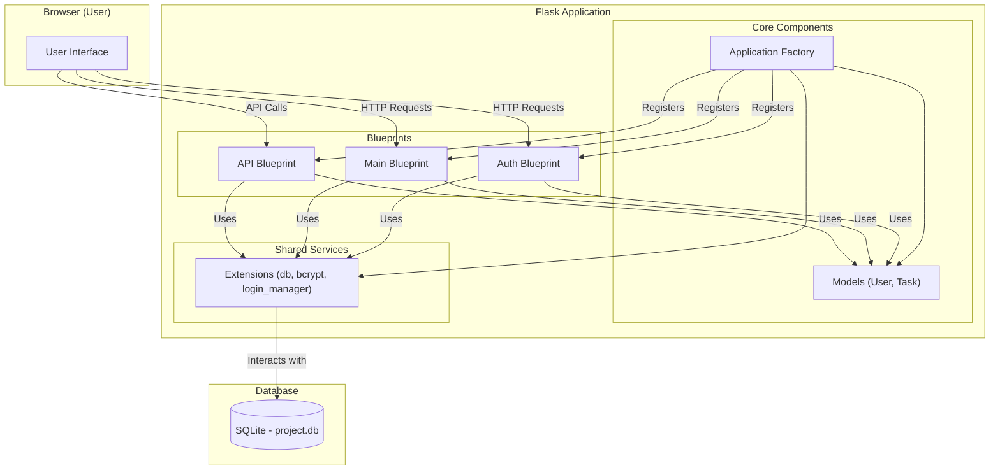

# Flask Mission Control

### **By George Freedom**

A full-stack database-driven To-Do application built with Flask. It serves as a practical case study for architecting a modern web application using professional patterns and an AI-assisted workflow.

### ⚙️ Core System Capabilities:
It demonstrates key concepts including:

* Application Factory pattern
* Blueprints for modularity
* SQLAlchemy for database interaction (ORM)
* WTForms for form handling and validation
* Flask-Login for session-based user authentication
* Flask-Bcrypt for secure password hashing
* A basic REST API endpoint


## 🚀 Key Features
* **User Authentication:** Secure registration and login system.

* **Password Security:** Passwords hashed using Bcrypt.

* **Task Management:** Full CRUD (Create, Read, Update, Delete) functionality for user-specific tasks.

* **Web Interface:** User-friendly HTML interface rendered using Jinja2 templates.

* **REST API:** A dedicated endpoint (/api/tasks) providing task data in JSON format (GET and POST methods supported).

* **Modular Design:** Clean structure using Blueprints, ready for future expansion.

* **Simple CSS styling:** Minimalistic styling with Pico CSS.

## API Endpoint

The application provides a simple REST API for accessing task data programmatically.

* **Endpoint:** `/api/tasks`
* **Methods:**
    * `GET`: Retrieves a list of all tasks for the authenticated user.
    * `POST`: Creates a new task for the authenticated user.
* **Authentication:** Requires the user to be logged in (uses session-based authentication).
* **Data Format:** JSON
    * `GET` Response: An array of task objects, each containing `id`, `name`, `finished`, `time_stamp` (ISO 8601 UTC), `due_date` (ISO 8601), and `user_id`.
    * `POST` Request Body: A JSON object containing `name` (string) and `due_date` (ISO 8601 string, e.g., "YYYY-MM-DD").
    * `POST` Response: The newly created task object as JSON (status code 201 Created).

## 🏗️ Project Architecture
The application utilizes the **Application Factory** pattern (`create_app` in `app/__init__.py`) for flexible configuration and initialization. It is structured into three distinct **Blueprints**:

* **Auth Blueprint (`/auth`):** Handles all user authentication logic (registration, login, logout) and associated forms.
* **Main Blueprint (`/`):** Contains the core user-facing application logic, including the main landing page (`/`) and the task management dashboard (`/dashboard`).
* **API Blueprint (`/api`):** Exposes task data via a RESTful JSON endpoint for machine-to-machine communication.

Data persistence is handled by an **SQLite database** located in the `instance` folder, managed via **Flask-SQLAlchemy**. User passwords are securely hashed using **Flask-Bcrypt**.

### System Diagram



## File Structure
```
flask-mission-control/
│
├── app/                      # Main application package
│   ├── __init__.py           # Application Factory
│   ├── models.py             # SQLAlchemy models (User, Task)
│   ├── extensions.py         # Extension instances (db, bcrypt, login_manager)
│   ├── config.py             # Configuration classes
│   ├── commands.py           # Custom CLI commands (e.g., init-db)
│   │
│   ├── main/                 # Main Blueprint (Dashboard, Index, About)
│   │   ├── __init__.py
│   │   ├── routes.py
│   │   └── forms.py            # Task Form
│   │
│   ├── auth/                 # Auth Blueprint (Login, Register, Logout)
│   │   ├── __init__.py
│   │   ├── routes.py
│   │   └── forms.py            # Login & Registration Forms
│   │
│   ├── api/                  # API Blueprint
│   │   ├── __init__.py
│   │   └── routes.py
│   │
│   ├── static/               # Static files (CSS, JS)
│   │   └── css/
│   │       └── site.css      # Custom styles (overrides Pico)
│   │
│   └── templates/            # Jinja2 templates
│       ├── base.html         # Base layout template
│       ├── header.html       # Navigation header include
│       ├── footer.html       # Footer include
│       │
│       ├── main/             # Templates for 'main' blueprint
│       │   ├── dashboard.html
│       │   ├── index.html
│       │   ├── about.html
│       │   └── update_task.html
│       │   └── add_task.html
│       │
│       └── auth/             # Templates for 'auth' blueprint
│           ├── login.html
│           └── register.html
│
├── instance/                 # Instance-specific files (DB, secrets - NOT in Git)
│   └── project.db            # SQLite database file
│
├── venv/                     # Virtual environment folder (NOT in Git)
│
├── wsgi.py                   # WSGI entry point for production servers
├── requirements.txt          # Python package dependencies
├── .env                      # Environment variables for development (NOT in Git)
├── .gitignore                # Files/folders ignored by Git
└── README.md                 # This file
```

## 💡 Development Philosophy & AI Collaboration
This project was intentionally developed using a modern, AI-augmented workflow to explore and demonstrate efficient development practices.

The process involved:

**Human-led architectural design:** Defining the project goals, requirements, structure (using patterns like Application Factory and Blueprints), and key principles (SOLID, SoC).

**AI-assisted scaffolding (LLM - e.g., Google Gemini):** Generating the initial project structure, boilerplate code, and documentation outlines based on the architectural plan.

**AI-assisted implementation (GitHub Copilot):** Writing tactical code within the IDE, handling routine tasks, generating functions/classes based on comments, and suggesting completions.

**Human-driven quality assurance:** Performing critical code reviews, debugging, testing, making final design decisions, and ensuring the final product meets the requirements.

This approach simulates a future-oriented development cycle where the developer's primary value shifts from writing every line of code to designing robust systems, effectively orchestrating AI tools, and guaranteeing the quality and integrity of the final result. It emphasizes the role of the developer as an architect and strategist.


## ⚙️ How to Run

1.  **Clone the Repository:**
    ```bash
    git clone https://github.com/GeorgeFreedomTech/flask-mission-control.git
    cd flask-mission-control
    ```
2.  **Create and Activate a Virtual Environment:**
    ```bash
    python -m venv venv
    # On Windows: venv\Scripts\activate
    # On macOS/Linux: source venv/bin/activate
    ```
3.  **Install Dependencies:**
    ```bash
    pip install -r requirements.txt
    ```
4.  **Create .env File:** Create a .env file in the project root directory and add the required environment variables 
    (copy from the example below, generating your own SECRET_KEY):
    ```bash
    # .env
    # Generate a strong secret key, e.g., using Python:
    >>> import os; os.urandom(24).hex()
    SECRET_KEY='your_generated_secret_key_here'
    DATABASE_FILE='project.db'
    FLASK_APP='wsgi.py' # Tells Flask where the app is
    FLASK_DEBUG='1'     # Enables debug mode for development
    ```
5.  **Initialize the Database:** Run the custom Flask command to create the database tables based on your models.
    ```bash
    flask init-db
    ```
6.  **Run the Development Server:**
    ```bash
    flask run
    ```

## 🔗 Let's Connect:

* Visit my website: **[https://GeorgeFreedom.com](https://GeorgeFreedom.com)**
* Connect on LinkedIn: **[https://www.linkedin.com/in/georgefreedom/](https://www.linkedin.com/in/georgefreedom/)**
* Let's talk: **[https://cal.com/georgefreedom](https://cal.com/georgefreedom)**


## 📜 License:

Copyright (c) 2025 Jiří Svoboda (George Freedom) / George Freedom Tech

This project is licensed under:
* Creative Commons Attribution-NonCommercial-ShareAlike 4.0 International License

---

We build for the Future!
